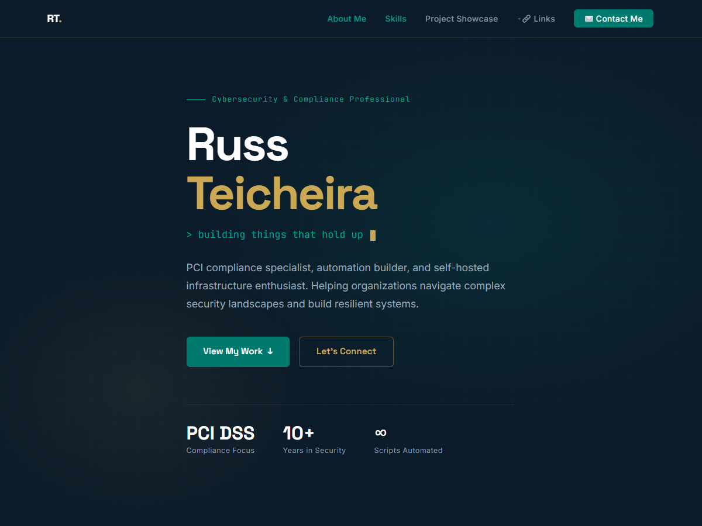

# Cybersecurity & Compliance Portfolio WordPress Theme

A custom WordPress theme for russteicheira.net.

> [!important]
> This is a work in progress - use at your own risk.



## Minimum Requirements

| Software | Version |
| -- | -- |
| WordPress | v. 6.2 |
| PHP | v. 7.4 |

## Structure

```text
wp-cs-theme/
├── style.css                  ← Required WP theme header
├── functions.php              ← Setup, enqueue, CPT, AJAX, helpers
├── theme.json                 ← Block editor color/font palette
├── front-page.php             ← Homepage (all sections)
├── index.php                  ← Blog archive
├── single.php                 ← Single blog post
├── page.php                   ← Static page template
├── archive-project.php        ← Project archive
├── 404.php                    ← Not found
├── header.php                 ← <head>, nav
├── footer.php                 ← footer, wp_footer()
├── screenshot.png             ← WP admin theme preview (1200×900)
├── css/
│   ├── main.css               ← All styles (tokens → responsive)
│   ├── fonts.css              ← @font-face declarations
│   └── fonts/                 ← Self-hosted woff2 files
│       ├── inter-v20-latin.woff2
│       ├── jetbrains-mono-v24-latin.woff2
│       └── space-grotesk-v22-latin.woff2
├── js/
│   ├── main.js                ← Nav, typewriter, smooth scroll, contact AJAX
│   └── customizer-preview.js  ← Customizer live preview bindings
├── template-parts/
│   ├── hero.php               ← Hero / above-the-fold section
│   ├── about.php              ← About Me + capabilities panel
│   ├── expertise.php          ← Core Expertise cards
│   ├── projects.php           ← Portfolio (Projects CPT)
│   ├── blog-preview.php       ← Latest 3 posts
│   └── contact.php            ← AJAX contact form
└── inc/
    ├── section-settings.php   ← Homepage Sections admin page (color controls, bg images)
    ├── customizer.php         ← Customizer panels, settings, controls
    └── fallback-nav.php       ← Hardcoded nav if no WP menu assigned
```

## Custom Post Types

### Projects

Each project supports:

- **Title** — project name
- **Excerpt** — card description (keep under 40 words)
- **Stack Tags** (taxonomy) — tech badges (Docker, PowerShell, etc.)
- **Featured thumbnail** — optional
- **Live URL** — meta field
- **GitHub URL** — meta field
- **Featured checkbox** — shows on homepage

### Capabilities

Displayed in the capabilities panel on the right side of the About section. Maximum of 5 items enforced.

- **Title** — capability name
- **Excerpt** — short description shown below the title
- **Icon** — emoji displayed alongside the title (meta field)

### Expertise

Displayed as cards in the Core Expertise section.

- **Title** — expertise area name
- **Excerpt** — card description
- **Icon** — emoji displayed on the card (meta field)
- **Skills** (taxonomy) — shared skill tags, same taxonomy used by the About section

## Contact Form

Submits via WordPress AJAX to `wp_mail()`. No plugin required.
Destination email = WP admin email (`Settings → General → Administration Email Address`).

## Responsive Breakpoints

| Breakpoint | Behavior |
| -- | -- |
| > 1024px | Full desktop layout |
| ≤ 1024px | Expertise grid → 2 col, footer adjusts |
| ≤ 900px | About/Contact stack to 1 col, blog sidebar hides |
| ≤ 768px | Hamburger nav activates |
| ≤ 640px | All grids → 1 col |
